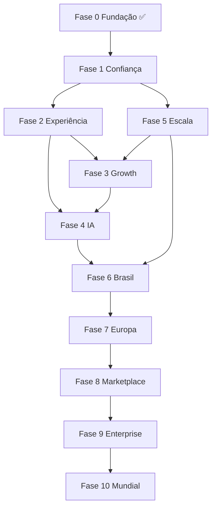

# TegLion — Roadmap Estratégico

**Plataforma de Crescimento para Escritórios de Contabilidade · Europa**

**Documento oficial · Última actualização: Julho 2026**

Este documento substitui o roadmap anterior orientado a «SaaS de gestão contábil». O TegLion passa a ser desenhado como **a principal plataforma de crescimento para escritórios de contabilidade na Europa** — não apenas uma ferramenta operacional, mas o **sistema nervoso** que permite ao escritório **ganhar clientes, reter clientes, poupar tempo e parecer premium**.

---

## 1. Mudança de paradigma

### O que éramos (roadmap anterior)

```
Fases 1–8: Limpeza → Arquitectura → Padronização → i18n → IA → Automações → Escala → Comercial
Foco implícito: construir um bom software de gestão operacional
```

### O que somos agora

```
Fases 0–10: Fundação → Experiência → Crescimento → Inteligência → Escala → Europa
Foco explícito: fazer o escritório CRESCER — em clientes, receita, eficiência e reputação
```

### Definição oficial (2026)

> **TegLion é a plataforma de crescimento B2B2C que liga escritórios de contabilidade aos seus clientes — com operações, comunicação, conformidade e inteligência num só lugar — para que o contabilista pare de perder tempo em administração e comece a ganhar mercado.**

### O que NÃO somos

- Não somos ERP (Primavera, PHC, Sage)
- Não somos software de facturação (Moloni, TOC)
- Não somos «mais um CRM genérico»

### O que SOMOS

| Camada | Função | Valor para crescimento |
|--------|--------|------------------------|
| **Operações** | Documentos, prazos, tarefas | Poupa 5–15h/semana → capacidade para mais clientes |
| **Relação** | Portal cliente, mensagens, WhatsApp | Retenção + NPS do cliente final → menos churn |
| **Reputação** | Marca do escritório, profissionalismo | Diferenciação vs concorrentes locais |
| **Inteligência** | IA, automações, alertas | Menos erros, menos stress, mais proactividade |
| **Expansão** | Multi-país, integrações, API | Escalar geograficamente sem reescrever |
| **Ecossistema** | Academia, parceiros, certificação | Network effects + switching cost humano |

---

## 2. Visão 2031

**Ser a plataforma de crescimento de referência para escritórios de contabilidade na Europa** — começando por Portugal e Brasil, expandindo para Espanha, Itália e mercado lusófono.

### Frase de posicionamento

> *«O sistema onde o escritório trabalha todos os dias — e onde o cliente sabe exactamente o que falta entregar — para o contabilista crescer sem caos.»*

### Metas de escala

| Dimensão | 2026 (hoje) | 2027 | 2029 | 2031 |
|----------|-------------|------|------|------|
| Escritórios activos | 50–200 (piloto) | 1.500 | 10.000 | 100.000 |
| Clientes finais (portal) | ~5.000 | 150.000 | 1.000.000 | 5.000.000+ |
| Países | PT (+ BR stub) | PT + BR | + ES | + IT, FR |
| ARR | Piloto | €1M+ | €10M+ | €100M+ |
| NPS escritório | Medir | >40 | >50 | >60 |

### Workstream crítico para 100.000 clientes activos

Para atingir escala real, o roadmap técnico-operacional deve manter estes pilares em paralelo às fases de produto:

1. SRE e observabilidade com SLOs, alertas e capacidade preditiva
2. Jobs assíncronos resilientes com filas dedicadas e retentativas seguras
3. Estratégia de dados para alto volume (índices, partição lógica e controlo de crescimento)
4. Release governance com gates obrigatórios de qualidade e segurança
5. Plano de continuidade (DR/BCP) testado periodicamente em ambiente real

### Diferenciais difíceis de copiar

1. **Portal cliente B2B2C** que o empresário recomenda
2. **CountryConfig** fiscal profundo por mercado
3. **Dados agregados** — benchmarks anónimos do sector
4. **Integrações certificadas** — AT, ERPs, WhatsApp, bancos
5. **TegLion Academy + Certified Partner** — comunidade e certificação
6. **IA operacional** treinada em fluxos reais de contabilidade

---

## 3. Os 6 pilares da plataforma de crescimento

Toda feature futura deve mapear para pelo menos um pilar:

```
┌─────────────────────────────────────────────────────────────────┐
│                    TEG LION GROWTH PLATFORM                      │
├─────────────┬─────────────┬─────────────┬─────────────────────────┤
│  POUPAR     │  RETER      │  GANHAR     │  PARECER               │
│  TEMPO      │  CLIENTES   │  CLIENTES   │  PREMIUM               │
│  (Ops+IA)   │  (Portal)   │  (Growth)   │  (Brand)               │
├─────────────┴─────────────┴─────────────┴─────────────────────────┤
│  ESCALAR (Infra + Países + API)  │  ECOSISTEMA (Academy+Partners) │
└─────────────────────────────────────────────────────────────────┘
```

### Pilar 1 — Poupar tempo (Operações + IA)

- Documentos, obrigações, tarefas, mensagens
- Automações, OCR, classificação, copilot
- **Métrica:** horas administrativas poupadas/escritório/mês

### Pilar 2 — Reter clientes (Portal B2B2C)

- Portal simples, mobile, notificações
- «O que falta entregar» sempre visível
- **Métrica:** taxa de upload no prazo; NPS cliente final

### Pilar 3 — Ganhar clientes (Growth)

- ROI visível, case studies, certificação
- Landing de alta conversão, referências
- **Métrica:** escritórios que citam TegLion na proposta comercial

### Pilar 4 — Parecer premium (Marca)

- White-label portal, comunicação profissional
- Relatórios ao cliente, badge «Escritório Digital»
- **Métrica:** % escritórios com branding activo

### Pilar 5 — Escalar (Plataforma)

- Multi-tenant, multi-país, API, integrações
- Infra 100k escritórios
- **Métrica:** p95 API < 300ms; uptime 99.9%

### Pilar 6 — Ecossistema (Comunidade)

- Academy, parceiros OCC/CRC, eventos
- Marketplace integrações
- **Métrica:** escritórios certificados; parceiros activos

---

## 4. Fundação concluída (Fases 0.1 e 0.2)

> O trabalho das antigas Fases 1 e 2 permanece válido — é a base técnica sobre a qual a plataforma de crescimento se constrói.

### Fase 0.1 — Limpeza ✅ (ex-Fase 1)

- Legacy removido; domínio contabilidade consolidado
- Stripe live; piloto com escritório real
- Documentação reorganizada

### Fase 0.2 — Arquitectura ✅ (ex-Fase 2)

- Monorepo; API modular; `/api/v1`
- CountryConfig registry (PT + BR stub)
- Stripe webhooks idempotentes; CI file-size limits
- E2E Playwright smoke

**Critério:** Base técnica sólida para vender e escalar. **Concluído.**

---

## 5. Roadmap em 10 fases (2026–2031)

```
Fase 0  ─ Fundação ────────────────► ✅ Concluída (0.1 + 0.2)
Fase 1  ─ Confiança para vender ──► Meses 1–3
Fase 2  ─ Experiência que retém ──► Meses 3–6
Fase 3  ─ Motor de crescimento ───► Meses 6–9
Fase 4  ─ Inteligência operacional► Meses 9–12
Fase 5  ─ Escala técnica ─────────► Meses 6–18 (paralelo)
Fase 6  ─ Brasil & lusófono ──────► Meses 12–18
Fase 7  ─ Europa Sul ─────────────► Meses 18–24
Fase 8  ─ Plataforma & Marketplace► Meses 24–36
Fase 9  ─ Enterprise ─────────────► Meses 30–48
Fase 10 ─ Referência mundial ─────► Meses 48–60
```

---

## Fase 1 — Confiança para vender

**Objectivo:** 50–200 escritórios pagantes com zero incidentes graves.  
**Duração:** Meses 1–3 · **Prioridade:** P0

### Porque esta fase existe

Sem confiança (segurança, uptime, onboarding), nenhuma estratégia de crescimento funciona. Esta fase transforma o piloto em **produto vendável**.

### Entregas

| # | Entrega | Pilar | Impacto | Complexidade | Tempo |
|---|---------|-------|---------|--------------|-------|
| 1.1 | Google SSO login + registo | Ops | Alto | Média | 2 sem |
| 1.2 | Migration SSO Supabase (`firm_user_sso`) | Ops | Alto | Baixa | 1 dia |
| 1.3 | WAF Cloudflare + rate limit edge | Escala | Alto | Baixa | 1 sem |
| 1.4 | Redis obrigatório; multi-instance Render | Escala | Alto | Média | 2 sem |
| 1.5 | Job queue BullMQ (cron, email, SMS) | Ops | Crítico | Alta | 3 sem |
| 1.6 | Paginação dashboard; índices email login | Escala | Alto | Média | 2 sem |
| 1.7 | Pentest externo + correcções | Confiança | Alto | Média | 2 sem |
| 1.8 | E2E: registo → upload → obrigação | Ops | Alto | Média | 3 sem |
| 1.9 | Staging real (Vercel + Render + Supabase) | Escala | Alto | Média | 1 sem |
| 1.10 | Fechar god files (portal.service, dashboard) | Ops | Médio | Alta | 4 sem |
| 1.11 | 10 testemunhos vídeo + 3 case studies | Growth | Muito alto | Baixa | Contínuo |
| 1.12 | Landing v2: vídeo 90s + ROI calculator | Growth | Alto | Média | 3 sem |

### Critérios de saída

- [ ] 100+ escritórios registados; 50+ pagantes
- [ ] Uptime 99.5%; zero incidentes P0
- [ ] Tenant isolation + security audit aprovados
- [ ] Trial → paid > 25%
- [ ] NPS piloto > 35

### Dependências

Google OAuth configurado; migration Supabase; Render keys.

---

## Fase 2 — Experiência que retém

**Objectivo:** O contador ama o software; o cliente usa o portal sem ajuda.  
**Duração:** Meses 3–6 · **Prioridade:** P0

### Entregas

| # | Entrega | Pilar | Impacto |
|---|---------|-------|---------|
| 2.1 | Dashboard «Hoje» — 3 acções prioritárias | Poupar tempo | Muito alto |
| 2.2 | Mapa fecho de mês v1 | Poupar tempo | Muito alto |
| 2.3 | Onboarding wizard escritório (3 passos) | Growth | Alto |
| 2.4 | Portal «O que falta entregar» | Reter | Muito alto |
| 2.5 | Tour portal cliente 30s | Reter | Alto |
| 2.6 | Design system unificado | Premium | Alto |
| 2.7 | Pesquisa global ⌘K | Poupar tempo | Alto |
| 2.8 | Import CSV clientes | Growth | Alto |
| 2.9 | Templates pedido documento | Poupar tempo | Alto |
| 2.10 | Bulk actions (clientes, obrigações) | Poupar tempo | Médio |
| 2.11 | Centro notificações unificado | Ops | Médio |
| 2.12 | Relatórios escritório v1 | Poupar tempo | Alto |
| 2.13 | Acessibilidade WCAG AA rotas críticas | Premium | Médio |
| 2.14 | Mobile polish portal PWA | Reter | Alto |

### Critérios de saída

- [ ] Activation trial > 55% (1º cliente + 1º pedido doc em 24h)
- [ ] 300 escritórios activos
- [ ] Churn mensal < 4%
- [ ] Tempo médio onboarding < 15 min

### Métrica norte desta fase

**% clientes finais que fazem upload no prazo** — proxy de retenção do escritório.

---

## Fase 3 — Motor de crescimento

**Objectivo:** O TegLion não só opera — **ajuda o escritório a vender e a crescer**.  
**Duração:** Meses 6–9 · **Prioridade:** P0

### Entregas

| # | Entrega | Pilar | Impacto |
|---|---------|-------|---------|
| 3.1 | Landing conversão completa (A/B, comparativos) | Ganhar | Muito alto |
| 3.2 | Calculadora ROI «horas poupadas» in-app | Ganhar | Alto |
| 3.3 | Badge «Escritório Digital TegLion» | Premium | Alto |
| 3.4 | Relatório PDF anual ao cliente do escritório | Reter + Premium | Alto |
| 3.5 | Programa referência escritório→escritório | Ganhar | Alto |
| 3.6 | WhatsApp Business API notificações | Reter | Muito alto |
| 3.7 | Integração AT consulta (NIF, validações) | Poupar + Premium | Muito alto |
| 3.8 | CRM lite: pipeline, tags, segmentos | Ganhar | Médio |
| 3.9 | Score «cliente em risco» (atrasos) | Reter | Alto |
| 3.10 | Academia TegLion v1 (10 vídeos + certificado) | Ecossistema | Alto |
| 3.11 | Parceria 2 associações contabilistas PT | Ecossistema | Muito alto |
| 3.12 | Google Ads + LinkedIn ABM (€5–10k/mês) | Ganhar | Alto |
| 3.13 | Pricing por clientes activos (não só users) | Growth | Alto |
| 3.14 | API pública v1 + webhooks | Escala | Alto |

### Critérios de saída

- [ ] 800 escritórios activos
- [ ] CAC payback < 12 meses
- [ ] 30% escritórios com branding portal activo
- [ ] 3+ parceiros activos (associações/formadores)

---

## Fase 4 — Inteligência operacional

**Objectivo:** IA que poupa tempo mensurável — não chatbot decorativo.  
**Duração:** Meses 9–12 · **Prioridade:** P1

### Entregas

| # | Entrega | Pilar | Impacto |
|---|---------|-------|---------|
| 4.1 | AI Gateway produção (audit, rate limit, RGPD) | Escala | Crítico |
| 4.2 | OCR + classificação documentos (PT) | Poupar | Muito alto |
| 4.3 | Extracção NIF, data, valor, IVA | Poupar | Alto |
| 4.4 | Sugestão pedidos documento por obrigação | Poupar | Alto |
| 4.5 | Draft email/mensagem cliente (tom PT) | Poupar | Médio |
| 4.6 | Copilot «O que falta para fechar o mês?» | Poupar | Muito alto |
| 4.7 | Alertas atraso inteligentes (ML básico) | Reter | Alto |
| 4.8 | RAG help center (deflexão suporte) | Ecossistema | Médio |
| 4.9 | Regras automação UI (if/then) | Poupar | Alto |
| 4.10 | Resumo thread mensagens | Poupar | Médio |

### Critérios de saída

- [ ] 3+ features IA em produção com métricas
- [ ] Custo IA < 5% receita/escritório
- [ ] 1.500 escritórios; ARR €1M+ run-rate
- [ ] Escritórios reportam ≥4h poupadas/mês (survey)

Ver [AI.md](../ai/AI.md).

---

## Fase 5 — Escala técnica

**Objectivo:** Suportar 10.000 escritórios / 1M clientes sem rewrite.  
**Duração:** Meses 6–18 (paralelo às Fases 3–4) · **Prioridade:** P0 infra

### Entregas

| # | Entrega | Critério |
|---|---------|----------|
| 5.1 | 2+ instâncias backend + load balancer | Zero single point of failure |
| 5.2 | Redis cluster (rate limit, cache, filas) | Fail-closed, não fail-open |
| 5.3 | Observability (APM, logs, alertas) | MTTR < 30 min |
| 5.4 | Status page pública | Transparência SLA |
| 5.5 | WAF + bot protection | Edge security |
| 5.6 | Read replicas Postgres | p95 dashboard < 500ms |
| 5.7 | Archival/partição (audit, messages, views) | Tabelas append-only controladas |
| 5.8 | CDN documentos | Latência download < 200ms |
| 5.9 | Load test 10k escritórios simulados | Sem degradação >20% |
| 5.10 | DR testado (RTO < 4h, RPO < 1h) | Runbook documentado |
| 5.11 | Pentest + SOC2 readiness | Roadmap compliance |
| 5.12 | CI security (audit deps, SAST) | Zero CVE crítico em prod |

### Critérios de saída

- [ ] p95 API < 300ms endpoints críticos
- [ ] Uptime 99.9%
- [ ] Zero downtime deploys

---

## Fase 6 — Brasil & mercado lusófono

**Objectivo:** Segundo mercado; validar CountryConfig como moat.  
**Duração:** Meses 12–18 · **Prioridade:** P1

### Entregas

| # | Entrega |
|---|---------|
| 6.1 | CountryConfig BR completo (locale, moeda, datas) |
| 6.2 | CPF/CNPJ validadores |
| 6.3 | Calendário fiscal BR |
| 6.4 | Obrigações BR (DAS, SPED, FGTS, etc.) |
| 6.5 | i18n pt-BR real (zero hardcoded PT) |
| 6.6 | Documentos legais LGPD |
| 6.7 | Stripe BRL |
| 6.8 | Blog pillar BR (10+ artigos SEO) |
| 6.9 | Landing localizada BR |
| 6.10 | Suporte BR (timezone, CS) |
| 6.11 | Parceria CRC/formadores BR |

### Critérios de saída

- [ ] 500 escritórios BR
- [ ] Escritório BR: registo → cliente CNPJ → calendário fiscal BR
- [ ] Testes CountryConfig PT + BR no CI

Ver [MULTI_COUNTRY.md](../international/MULTI_COUNTRY.md).

---

## Fase 7 — Expansão Europa Sul

**Objectivo:** Terceiro mercado; provar modelo pan-europeu.  
**Duração:** Meses 18–24 · **Prioridade:** P2

### Entregas

| # | Entrega |
|---|---------|
| 7.1 | CountryConfig ES (piloto) |
| 7.2 | Calendário fiscal ES |
| 7.3 | GDPR multi-lang (ES, EN) |
| 7.4 | Pagamentos locais ES |
| 7.5 | Parceiro local ES (associação contabilistas) |
| 7.6 | Blog + landing ES |
| 7.7 | Preparação IT (research + stub) |

### Critérios de saída

- [ ] 100 escritórios ES
- [ ] 6.000–10.000 escritórios total plataforma

---

## Fase 8 — Plataforma & Marketplace

**Objectivo:** Ecossistema que prende o escritório.  
**Duração:** Meses 24–36 · **Prioridade:** P2

### Entregas

| # | Entrega |
|---|---------|
| 8.1 | API pública v2 + developer portal |
| 8.2 | OAuth apps terceiros |
| 8.3 | Marketplace integrações (PHC, Primavera, Moloni) |
| 8.4 | Zapier / Make native |
| 8.5 | Webhooks outbound completos |
| 8.6 | White-label portal (domínio custom) |
| 8.7 | Programa parceiros revenue share |
| 8.8 | TegLion Connect evento anual |

---

## Fase 9 — Enterprise

**Objectivo:** Redes grandes de contabilidade e requisitos enterprise.  
**Duração:** Meses 30–48 · **Prioridade:** P2

### Entregas

| # | Entrega |
|---|---------|
| 9.1 | SAML SSO |
| 9.2 | SLA 99.9% contratual |
| 9.3 | Dedicated instances |
| 9.4 | SOC2 Type II |
| 9.5 | Permissões granulares RBAC avançado |
| 9.6 | IP allowlist |
| 9.7 | Account manager + CSM enterprise |
| 9.8 | Custom contracts + invoicing PT/EU |

---

## Fase 10 — Referência mundial

**Objectivo:** 100.000 escritórios; empresa de centenas de milhões.  
**Duração:** Meses 48–60 · **Prioridade:** P3

### Entregas

| # | Entrega |
|---|---------|
| 10.1 | Multi-region (EU + BR data residency) |
| 10.2 | IA v2 multi-modal (voz, foto, vídeo) |
| 10.3 | Benchmarks indústria anónimos |
| 10.4 | M&A integrações menores |
| 10.5 | Expansão FR, DE (avaliação) |
| 10.6 | IPO-ready metrics (Rule of 40) |

---

## 6. Plano 24 meses (executivo)

### Ano 1 — «De piloto a máquina de crescimento PT»

| Trimestre | Foco | Meta escritórios | Meta ARR |
|-----------|------|------------------|----------|
| **Q1** | Fase 1 Confiança | 100 pagantes | €30K |
| **Q2** | Fase 2 Experiência | 300 | €100K |
| **Q3** | Fase 3 Growth + Fase 5 Escala | 800 | €300K |
| **Q4** | Fase 4 IA + prep BR | 1.500 | €1M |

### Ano 2 — «Brasil + Europa + plataforma»

| Trimestre | Foco | Meta escritórios | Meta ARR |
|-----------|------|------------------|----------|
| **Q5** | Fase 6 BR launch | 2.500 | €1.5M |
| **Q6** | BR scale + IA v2 | 4.000 | €2.5M |
| **Q7** | Fase 7 ES pilot | 5.500 | €3.5M |
| **Q8** | Fase 8 Marketplace v1 | 8.000–10.000 | €5M+ |

### Regra de alocação de esforço

| Área | % esforço eng+produto |
|------|---------------------|
| Portal + documentos + prazos + comunicação | **70%** |
| IA que poupa tempo mensurável | **20%** |
| Platform/API/partners | **10%** |

**Nunca** shippar feature sem métrica de activação definida.

---

## 7. Métricas norte (North Star)

### Métrica principal

> **Horas administrativas poupadas por escritório por mês**

Se não medimos e mostramos, somos «mais um software». Se mostramos 8h/mês, somos insubstituíveis.

### Métricas de crescimento da plataforma

| Métrica | Definição | Alvo 2027 |
|---------|-----------|-----------|
| **Activation rate** | Trial que completa: 1 cliente + 1 pedido doc em 7 dias | >55% |
| **WAU/MAU escritório** | Engajamento staff | >60% |
| **Portal adoption** | % clientes finais com login | >40% |
| **Upload on-time rate** | Docs no prazo | >70% |
| **NPS escritório** | Promotores − detratores | >45 |
| **NPS cliente final** | Survey portal | >30 |
| **Churn mensal** | Escritórios que cancelam | <3% |
| **Expansion revenue** | Upsell clientes activos/plano | >15% MRR |
| **CAC payback** | Meses para recuperar CAC | <12 |
| **Referral rate** | Novos escritórios via referência | >20% |

### Métricas técnicas

| Métrica | 2026 | 2027 | 2029 |
|---------|------|------|------|
| Uptime | 99.5% | 99.9% | 99.95% |
| p95 API | <500ms | <300ms | <200ms |
| Test coverage BE | 40% | 70% | 80% |
| Incidentes P0/trim | <2 | <1 | 0 |

---

## 8. Organização para escala (100k escritórios)

### Equipa alvo por fase

| Função | Fase 1–2 (0–300) | Fase 3–4 (300–1.5k) | Fase 5+ (10k+) |
|--------|------------------|---------------------|----------------|
| Engenharia | 3–5 full-stack | 8–12 (squads) | 40–60 |
| Produto | 1 PM + founder | 2 PM + 1 designer | 8 PM |
| Design | 1 product designer | 2 designers | Design system team |
| QA | Automate + 1 lead | 2 SDET | QA platform |
| CS / Suporte | Founder + docs | 2 CSM + tier 1 | 15+ CS |
| Vendas | PLG + founder outbound | 2 inside sales | 10+ sales |
| Marketing | Content + ads | Growth team 3 | Brand 8+ |
| SRE/DevOps | Shared eng | 1 dedicated | SRE 24/7 |

### Máquinas de crescimento (não só produto)

1. **TegLion Academy** — certificação contabilistas
2. **TegLion Connect** — evento anual + webinars mensais
3. **Programa embaixadores** — contabilistas que referem
4. **Parcerias OCC / associações** — credibilidade
5. **Content SEO** — 2 posts/semana fiscal PT/BR/ES
6. **API partners** — ERPs e fintechs
7. **Status page + SLA público** — confiança enterprise

---

## 9. Backlog master (índice)

Backlog completo com **350+ melhorias** organizado por categoria. Cada item inclui: título, prioridade (P0–P3), impacto, complexidade, valor cliente, valor negócio.

| Categoria | Itens | Doc detalhado |
|-----------|-------|---------------|
| A. Plataforma & Fundação | 1–40 | [ROADMAP_BACKLOG.md](../_archive/product/ROADMAP_BACKLOG.md) |
| B. Clientes & CRM | 41–70 | idem |
| C. Documentos | 71–110 | idem |
| D. Obrigações & Fiscal | 111–145 | idem |
| E. Portal Cliente | 146–175 | idem |
| F. Comunicação | 176–205 | idem |
| G. Automação | 206–235 | idem |
| H. IA & Dados | 236–275 | idem |
| I. UX/UI & Design | 276–305 | idem |
| J. Growth & Landing | 306–330 | idem |
| K. API & Integrações | 331–350 | idem |

---

## 10. Dependências entre fases



**Fase 5** corre em paralelo desde Fase 1.  
**Fase 3** (growth) não espera IA — começa assim que experiência (Fase 2) está estável.

---

## 11. Princípios de decisão (actualizados)

Antes de qualquer entrega, validar:

1. **Isto ajuda o escritório a poupar tempo?** (Pilar Poupar)
2. **Isto ajuda a reter clientes do escritório?** (Pilar Reter)
3. **Isto ajuda o escritório a ganhar novos clientes?** (Pilar Ganhar)
4. **Isto faz o escritório parecer mais premium?** (Pilar Premium)
5. **Isto escala para 100k escritórios?** (Pilar Escalar)
6. **Isto fortalece o ecossistema?** (Pilar Ecossistema)

Se **não** a nenhuma → não entra no roadmap.

### Anti-patterns (não fazer)

- Feature de ERP (lançamentos contábeis profundos)
- Chatbot genérico sem contexto fiscal
- País novo sem CountryConfig completo
- Escala de ads sem onboarding que activa
- IA sem métrica de tempo poupado

---

## 12. Relação com outros documentos

| Documento | Conteúdo | Actualizar |
|-----------|----------|----------|
| [VISION.md](./VISION.md) | Missão e visão 2031 | ✅ Alinhado |
| [PRODUCT.md](./PRODUCT.md) | Modelo negócio | Revisar pricing Fase 3 |
| [ROADMAP_BACKLOG.md](../_archive/product/ROADMAP_BACKLOG.md) | 350+ itens detalhados (arquivo) | Novo |
| [MODULES.md](./MODULES.md) | Inventário módulos | Por fase |
| [ARCHITECTURE.md](../engineering/ARCHITECTURE.md) | Como construir | Fase 5 |
| [AI.md](../ai/AI.md) | Estratégia IA | Fase 4 |
| [MULTI_COUNTRY.md](../international/MULTI_COUNTRY.md) | PT/BR/ES | Fase 6–7 |
| [STATUS.md](../operations/STATUS.md) | Estado actual | Por sprint |
| [CHANGELOG.md](./CHANGELOG.md) | Histórico | Por release |

---

## 13. Veredito — O plano se o TegLion fosse meu

Se competisse com qualquer software europeu nos próximos 24 meses:

1. **Meses 1–3:** Confiança absoluta — segurança, uptime, Google SSO, onboarding, 15 testemunhos reais
2. **Meses 4–6:** Dashboard «Hoje», fecho de mês, portal «o que falta», WhatsApp — o contador sente valor diário
3. **Meses 7–9:** Growth machine — ROI in-app, referências, AT, ads com landing que converte
4. **Meses 10–12:** IA v1 (OCR + copilot fecho mês) + prep Brasil — diferenciação clara
5. **Meses 13–18:** Brasil + marketplace integrações PT — segundo mercado
6. **Meses 19–24:** Espanha pilot + enterprise SAML — «plataforma europeia»

**Não** tentaria competir com ERP. **Sim** tentaria que todo empresário em Portugal dissesse: *«O meu contabilista é moderno — tenho portal TegLion.»*

Esse é o caminho para centenas de milhões de euros de valor.

---

*Documento estratégico · Reestruturação completa Julho 2026 · Baseado em auditoria técnica e plano CTO*
